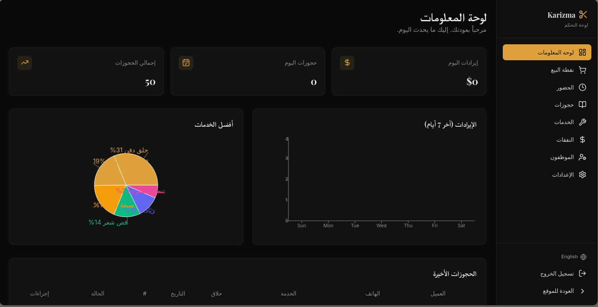

# 💈 Barber Shop Management System

> Full-stack barber shop management application for handling customer bookings, services, employees, attendance, point-of-sale operations, expenses, and business administration.

[](https://www.typescriptlang.org/)
[](https://react.dev/)
[](https://vitejs.dev/)
[](https://supabase.com/)
[](https://tanstack.com/query)
[](https://tailwindcss.com/)
[](LICENSE)

---

## Overview

### Problem Statement

Many small barber shops still manage appointments, employees, attendance, services, payments, and expenses manually or through separate tools.

This creates fragmented workflows and makes it harder for business owners to monitor daily operations.

Barber Shop Management System brings these workflows into a single web application.

### Target Audience

The application is designed for:

- Barber shop owners
- Administrators
- Cashiers
- Barbers
- Customers booking appointments

### Purpose & Technical Justification

This project was built to practice developing a real-world business management application with multiple user roles and operational workflows.

The repository demonstrates:

- Role-based access control
- Authentication and user profiles
- Customer booking management
- Administrative dashboard workflows
- Employee and attendance management
- Point-of-sale operations
- Expense tracking
- Persistent cloud data using Supabase
- Internationalization support
- Responsive frontend architecture

---

# Features

## Customer Experience

### Online Booking

Customers can submit barber shop appointments with information including:

- Customer name
- Phone number
- Selected service
- Preferred barber
- Booking date
- Booking time
- Additional notes

Booking records are persisted in Supabase.

### Services

Customers can browse active barber shop services with information such as:

- English service name
- Arabic service name
- Price
- Duration
- Category

Inactive services are excluded from public availability.

---

## Authentication & User Management

The application includes authentication and user profile management through Supabase.

Each user can have:

- Display name
- Phone number
- Avatar URL
- Preferred language
- Application role

User profiles are automatically created when new users sign up.

---

## Role-Based Access Control

The application supports multiple roles:

- `admin`
- `barber`
- `customer`
- `casher`

Access permissions are enforced through Supabase Row Level Security policies.

Administrators can manage business resources such as:

- Services
- Employees
- Attendance
- Bookings
- Bills
- Settings

Cashiers have access to operational workflows such as:

- Bills
- Bookings

---

## Admin Dashboard

The administration area provides dedicated sections for managing barber shop operations.

### Dashboard

The dashboard provides a centralized interface for monitoring and navigating business operations.

### Services Management

Administrators can manage barber shop services including:

- Service names
- Pricing
- Duration
- Categories
- Active status
- Additional service fees

---

## Booking Management

The booking management system allows administrators and authorized users to manage appointment records.

Bookings include:

- Customer information
- Service selection
- Barber preference
- Appointment date
- Appointment time
- Status
- Notes

---

## Employee Management

Employees are stored as dedicated business records.

Employee information includes:

- Name
- Role
- Phone number
- Commission percentage
- Schedule
- Active status

---

## Attendance Management

The attendance system tracks employee presence and working hours.

Attendance records include:

- Employee
- Date
- Clock-in time
- Clock-out time
- Status
- Notes

A unique database constraint prevents duplicate attendance records for the same employee and date.

---

## Point of Sale

The POS section supports operational billing workflows.

Bills include:

- Purchased items
- Subtotal
- Discount
- Total
- Payment method
- Status
- Creation date

Bill items are stored as structured JSON data.

---

## Expense Management

The administration area includes an expense management section for tracking business expenses.

This allows operational costs to be managed alongside other barber shop activities.

---

## Application Settings

The application stores configurable settings in the database.

Current settings include values such as:

- Default language
- Additional fee configuration
- Date-based fee intervals

Settings are protected through role-based database policies.

---

## Internationalization

The application supports internationalization using:

- i18next
- react-i18next
- i18next-browser-languagedetector

The application dynamically updates:

- Document language
- Text direction

Arabic uses RTL layout while other supported languages use LTR layout.

---

## Data Export

The project includes export-related dependencies and an `ExportButton` component.

Supported export tooling includes:

- CSV generation
- PDF generation
- PDF tables

The implementation uses:

- PapaParse
- jsPDF
- jsPDF AutoTable

---

## UI & User Experience

The application includes:

- Responsive layouts
- Reusable UI components
- Toast notifications
- Tooltips
- Dialogs
- Dropdown menus
- Form controls
- Date pickers
- Animations
- Theme support
- Accessible Radix UI primitives

---

# Screenshots

> Add real project screenshots here.

| View | Screenshot |
| --- | --- |
| **Landing Page** | `screenshots/landing.png` |
| **Admin Dashboard** | `screenshots/dashboard.png` |
| **POS** | `screenshots/pos.png` |
| **Bookings** | `screenshots/bookings.png` |
| **Employees** | `screenshots/employees.png` |
| **Attendance** | `screenshots/attendance.png` |

Example:

```md

