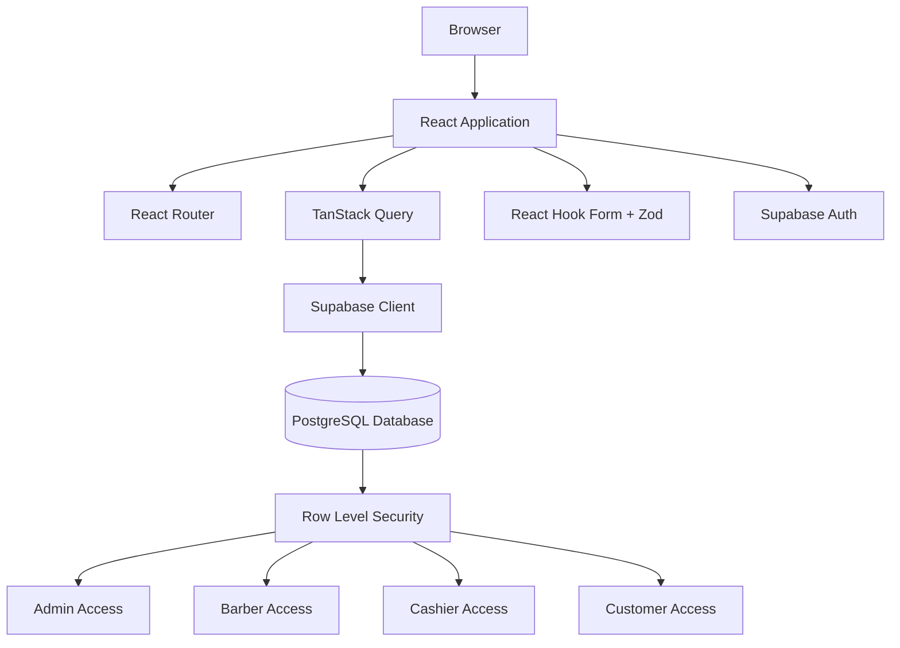
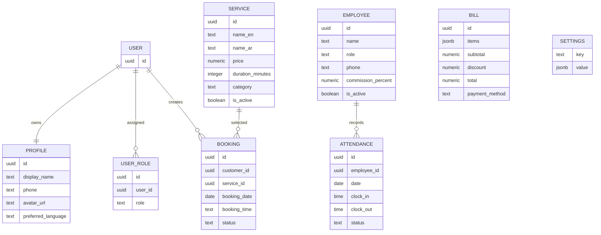
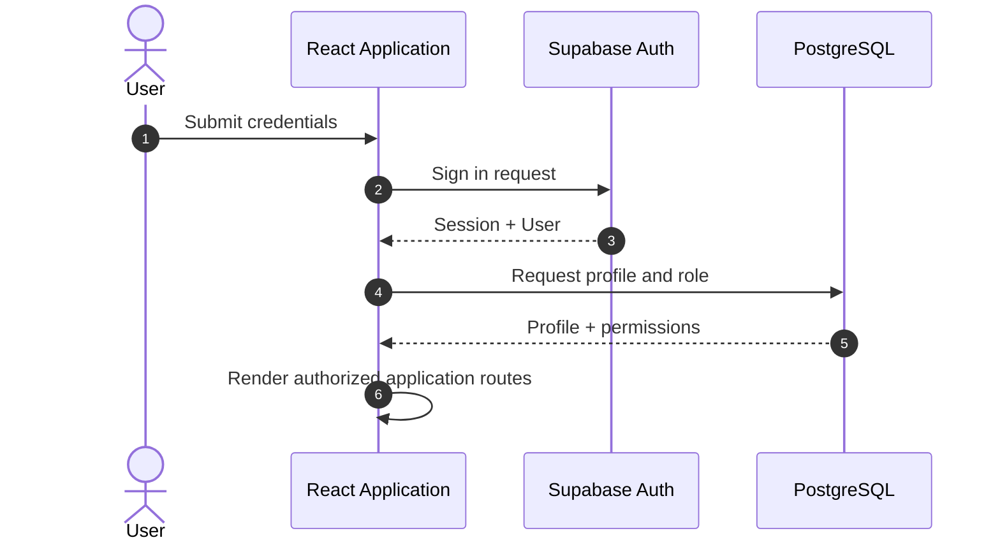

# 💈 Barber Shop

> Full-stack barber shop management platform for customer bookings, service management, employee operations, attendance tracking, point-of-sale workflows, and business administration.

[](https://www.typescriptlang.org/)
[](https://react.dev/)
[](https://vitejs.dev/)
[](https://supabase.com/)
[](https://tanstack.com/query)
[](https://tailwindcss.com/)
[](LICENSE)

---

## Overview

### Problem Statement

Running a service-based business involves more than presenting services online. Barber shops need to coordinate customer appointments, employees, attendance, payments, operational expenses, and administrative workflows.

When these processes are managed manually or across disconnected tools, day-to-day operations become difficult to monitor and maintain.

Barber Shop centralizes these workflows into a single web application.

### Target Audience

The platform is designed for:

- Barber shop owners
- Administrators
- Barbers
- Cashiers
- Customers

### Project Scope

The application combines two primary experiences:

1. **Customer-facing experience**
   - Browse services
   - Submit booking requests
   - Interact with the public barber shop interface

2. **Administrative experience**
   - Manage services
   - Manage bookings
   - Manage employees
   - Track attendance
   - Handle POS workflows
   - Track expenses
   - Configure application settings

---

## Core Features

### Customer Booking

Customers can create appointment requests by providing information such as:

- Customer name
- Phone number
- Selected service
- Preferred barber
- Appointment date
- Appointment time
- Additional notes

Booking records are persisted through Supabase.

---

### Service Management

Administrators can manage the services provided by the barber shop.

Each service can include:

- English name
- Arabic name
- Price
- Duration
- Category
- Active status
- Additional fee configuration

Only active services are intended to be available to customers.

---

### Authentication & Profiles

Authentication is handled through Supabase.

User profiles support information such as:

- Display name
- Phone number
- Avatar
- Preferred language

User profile data is maintained separately from authentication credentials.

---

### Role-Based Access Control

The application supports role-based access for different user types.

Supported roles include:

```text
admin
barber
customer
casher
````

Roles are stored independently from user profile information and are used to control access to application resources.

Administrative access controls management operations such as:

* Services
* Employees
* Attendance
* Bookings
* Expenses
* Settings

---

### Employee Management

Administrators can manage employee records including:

* Name
* Role
* Phone number
* Commission percentage
* Work schedule
* Active status

This separates employee business data from customer authentication profiles.

---

### Attendance Tracking

The attendance module tracks employee working activity.

Attendance records include:

* Employee
* Date
* Clock-in time
* Clock-out time
* Attendance status
* Notes

Database constraints prevent duplicate attendance records for the same employee and date.

---

### Point of Sale

The POS module supports operational billing workflows.

Bills can include:

* Purchased items
* Subtotal
* Discount
* Final total
* Payment method
* Bill status

Bill items are stored as structured data to represent multiple items within a transaction.

---

### Expense Management

The administrative area includes expense tracking for recording operational business costs.

This provides a dedicated workflow for managing expenses separately from customer bookings and POS transactions.

---

### Application Settings

Application settings are stored persistently and can be used to configure business behavior.

Settings include configuration values related to:

* Language preferences
* Additional fees
* Date-based business rules

---

### Internationalization

The application supports multiple languages through `i18next`.

Language handling includes:

* Browser language detection
* Dynamic language switching
* English and Arabic content support
* RTL support for Arabic

The application updates the document direction based on the active language.

---

### Data Export

The project includes export functionality using:

* PapaParse for CSV generation
* jsPDF for PDF generation
* jsPDF AutoTable for structured PDF tables

---

## Screenshots

> Replace these placeholders with real screenshots from the application.

| View             | Screenshot                     |
| ---------------- | ------------------------------ |
| **Landing Page** | `./screenshots/landing.png`    |
| **Dashboard**    | `./screenshots/dashboard.png`  |
| **Bookings**     | `./screenshots/bookings.png`   |
| **POS**          | `./screenshots/pos.png`        |
| **Employees**    | `./screenshots/employees.png`  |
| **Attendance**   | `./screenshots/attendance.png` |

---

## Tech Stack

| Layer                | Technology      | Purpose                                   |
| -------------------- | --------------- | ----------------------------------------- |
| Frontend             | React           | Component-based UI development            |
| Language             | TypeScript      | Static type safety                        |
| Build Tool           | Vite            | Development server and production builds  |
| Styling              | Tailwind CSS    | Utility-first styling                     |
| Routing              | React Router    | Client-side routing                       |
| Server State         | TanStack Query  | Remote data fetching and caching          |
| Backend              | Supabase        | Backend platform and application services |
| Database             | PostgreSQL      | Persistent relational data storage        |
| Authentication       | Supabase Auth   | Authentication and session management     |
| Authorization        | PostgreSQL RLS  | Database-level access control             |
| Forms                | React Hook Form | Form state management                     |
| Validation           | Zod             | Schema validation                         |
| Internationalization | i18next         | Multi-language support                    |
| UI Components        | Radix UI        | Accessible UI primitives                  |
| Animation            | Framer Motion   | Interface animations                      |
| Charts               | Recharts        | Data visualization                        |
| Testing              | Vitest          | Test runner                               |
| CSV Export           | PapaParse       | CSV generation                            |
| PDF Export           | jsPDF           | PDF document generation                   |
| Deployment           | Vercel          | Frontend deployment                       |

---

## Architecture

The application uses a frontend-driven architecture where the React client communicates directly with Supabase for authentication and database operations.



### Architectural Principles

1. **Separation of Responsibilities**
   Presentation components, page-level views, hooks, integrations, and utilities are separated into dedicated application layers.

2. **Server-State Management**
   Remote data is handled through TanStack Query instead of mixing asynchronous server data with local UI state.

3. **Database-Level Authorization**
   Access control is enforced through Supabase Row Level Security policies rather than relying exclusively on frontend route protection.

4. **Typed Application Development**
   TypeScript is used across the frontend to improve consistency and reduce runtime errors.

5. **Reusable UI Components**
   Shared interface primitives are organized separately from business-specific components.

---

## Project Structure

```text
barber-shop/
├── public/
│
├── src/
│   ├── assets/
│   │
│   ├── components/
│   │   ├── admin/
│   │   ├── landing/
│   │   └── ui/
│   │
│   ├── hooks/
│   │
│   ├── i18n/
│   │
│   ├── integrations/
│   │   └── supabase/
│   │
│   ├── lib/
│   │
│   ├── pages/
│   │   ├── admin/
│   │   │   ├── Attendance.tsx
│   │   │   ├── Bookings.tsx
│   │   │   ├── Dashboard.tsx
│   │   │   ├── Employees.tsx
│   │   │   ├── Expenses.tsx
│   │   │   ├── POS.tsx
│   │   │   ├── ServicesManagement.tsx
│   │   │   └── Settings.tsx
│   │   │
│   │   ├── Auth.tsx
│   │   ├── Index.tsx
│   │   └── NotFound.tsx
│   │
│   ├── test/
│   │
│   ├── App.tsx
│   └── main.tsx
│
├── supabase/
│   ├── migrations/
│   └── config.toml
│
├── package.json
├── vite.config.ts
├── vitest.config.ts
└── vercel.json
```

---

## Database Design

The application uses PostgreSQL through Supabase.

Core business entities include:

* Profiles
* User Roles
* Services
* Bookings
* Employees
* Attendance
* Bills
* Settings

### Entity Relationships



---

## Authentication Flow



---

## Installation

### Prerequisites

* Node.js `>= 18`
* npm
* Supabase project

---

### 1. Clone the Repository

```bash
git clone https://github.com/eldgwy/barber-shop.git
cd barber-shop
```

### 2. Install Dependencies

```bash
npm install
```

### 3. Configure Environment Variables

Create a `.env` file:

```env
VITE_SUPABASE_URL=your_supabase_project_url
VITE_SUPABASE_ANON_KEY=your_supabase_anon_key
```

> Do not expose Supabase service role credentials in frontend environment variables.

### 4. Apply Database Migrations

Database migrations are located in:

```text
supabase/migrations/
```

Apply them to your Supabase project using the Supabase CLI or SQL editor.

### 5. Start the Application

```bash
npm run dev
```

---

## Available Scripts

```bash
# Start development server
npm run dev

# Create production build
npm run build

# Run ESLint
npm run lint

# Preview production build
npm run preview

# Run tests
npm run test

# Run tests in watch mode
npm run test:watch
```

---

## Security

The application uses Supabase and PostgreSQL Row Level Security for access control.

Security mechanisms include:

* Supabase authentication
* User profile ownership policies
* Role-based authorization
* Customer-specific booking access
* Administrative resource protection
* Database-level Row Level Security policies

---

## Testing

Testing is configured with Vitest.

```bash
npm run test
```

The testing setup can be expanded to cover:

* Component behavior
* Form validation
* Business workflows
* Data transformation
* Role-based access behavior

---

## Deployment

The project is configured for deployment on Vercel.

Deployment workflow:

1. Push the repository to GitHub.
2. Import the project into Vercel.
3. Configure Supabase environment variables.
4. Deploy.

The frontend is hosted on Vercel while Supabase provides:

* Authentication
* PostgreSQL database
* Row Level Security
* Backend services

---

## Roadmap

* [x] Customer-facing barber shop interface
* [x] Authentication
* [x] User profiles
* [x] Role-based access control
* [x] Service management
* [x] Booking management
* [x] Employee management
* [x] Attendance tracking
* [x] Point-of-sale workflows
* [x] Expense tracking
* [x] Application settings
* [x] Internationalization
* [x] CSV and PDF export tooling
* [ ] Increase automated test coverage
* [ ] Advanced analytics and reporting
* [ ] More granular role permissions
* [ ] Advanced appointment availability management

---

## Learning Outcomes

This project demonstrates practical experience with:

* React application architecture
* TypeScript
* Authentication and session management
* Role-based access control
* PostgreSQL data modeling
* Supabase integration
* Row Level Security
* Server-state management
* Form validation
* Internationalization
* Business workflow implementation
* Employee operations
* POS workflows
* Testing
* Cloud deployment

```
